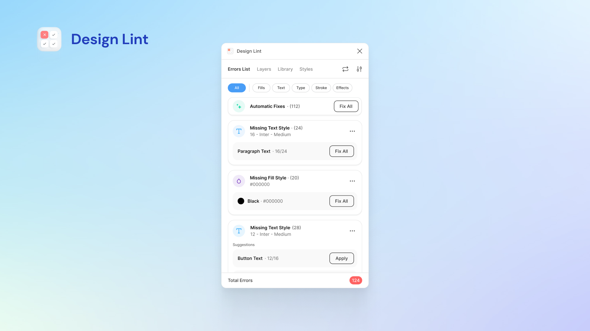
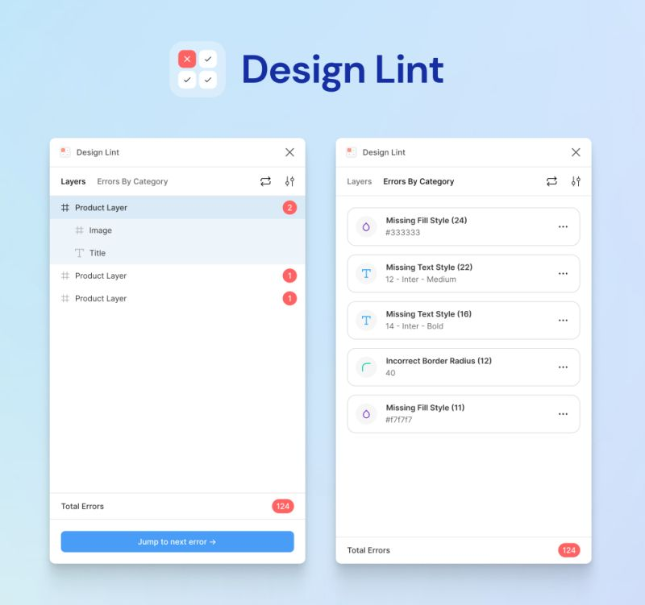
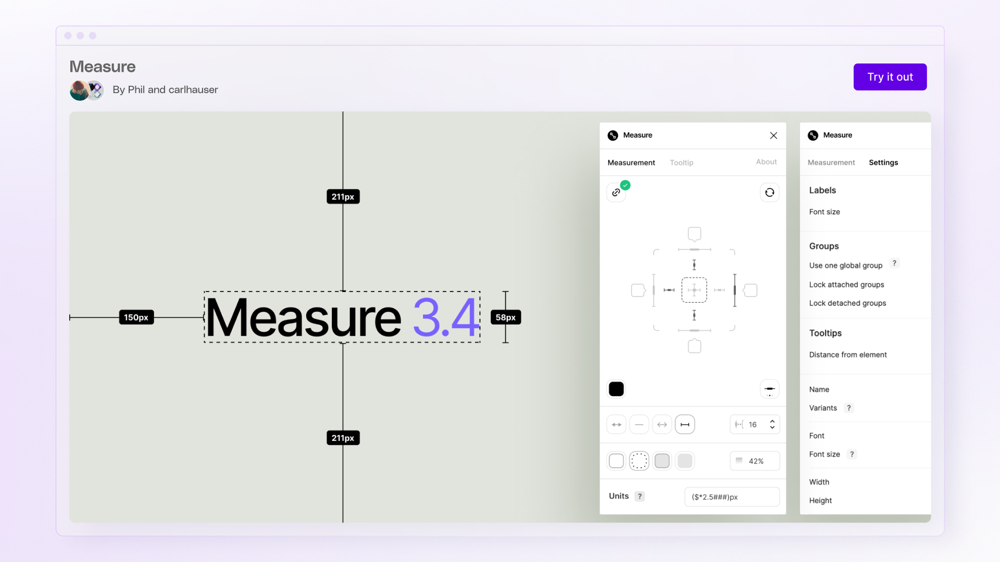

# Design Lint Figma Plugin - Find And Fix Missing Styles

Design Lint Figma Plugin finds missing styles on the layers in a Figma file. Design Lint Plugin updates the list while you fix those layers, and a click selects the same layer in the file. This open source design lint plugin keeps handoff ready for development without accounts or library sync.



## Capabilities

Design Lint Plugin checks layers that are not using styles. In Figma, styles, also called design tokens, should cover type, color, and spacing so a file stays consistent. Design Lint Figma Plugin is the build that runs this scan.

* Selecting a layer with an error also selects that layer in Figma, so you can fix it with full context.
* Design Lint Figma Plugin polls for changes and updates as you fix errors.
* Ignore and Ignore All buttons skip special layers.
* Select All fixes several errors that share the same value.
* Locked layers are skipped, which keeps illustrations out of the scan.
* Custom border radius values can be stored for the file.



## Rules

Design Lint Plugin keeps product code aligned with a token-based design system. These rules name colors, themes, and component appearances in one place.

| Rule | What it does |
| --- | --- |
| [`no-style-color`](rules/no-style-color.js) | Reports color applied through a style prop. |
| [`no-raw-color`](rules/no-raw-color.js) | Reports literal colors such as a hex value, an rgb value, or a color name. |
| [`no-spectral-color`](rules/no-spectral-color.js) | Reports a palette class when a semantic token should be used. |
| [`no-undefined-token`](rules/no-undefined-token.js) | Reports a token-like color class that does not exist. |
| [`token-constraints`](src/token-constraints.js) | Reports a valid token used in the wrong role. |
| [`no-opacity-modifier`](rules/no-opacity-modifier.js) | Reports a color class with an opacity modifier. |
| [`no-dark-variant`](rules/no-dark-variant.js) | Reports a local theme branch. |
| [`no-useless-hover`](rules/no-useless-hover.js) | Reports a hover style on an element that is not interactive. |
| [`no-component-color-override`](rules/no-component-color-override.js) | Reports a color class passed into a design-system component. |

Colors should be semantic. Code should say what a color means, and the design system should decide the value in each theme.

The rules cover three common breaks:

1. A color is written directly.
2. A color bypasses the token vocabulary.
3. A token is used outside its intended role.

The goal is not a single visual style. The goal is to keep design decisions named, searchable, themeable, and reviewable. Design Lint Plugin ships these checks in the rules folder.

## How The Linting Works

Different layers have different properties to lint. Design Lint Figma Plugin loops through the selected layers and reads each layer type.

```javascript
function determineType(node) {
  switch (node.type) {
    case "GROUP":
    case "SLICE":
      return [];
    case "TEXT":
      return lintTextRules(node);
    case "FRAME":
      return lintFrameRules(node);
    default:
      return lintShapeRules(node);
  }
}
```

Shared helpers live in [lintingFunctions.ts](src/lintingFunctions.ts). Text layers call fills, effects, strokes, and type checks.

```javascript
function lintTextRules(node) {
  let errors = [];
  checkType(node, errors);
  checkFills(node, errors);
  checkEffects(node, errors);
  checkStrokes(node, errors);
  return errors;
}
```

A frame only lints fills, effects, and strokes, because it has no type style. Variable checks sit in [lintingFunctionsforVariables.ts](src/lintingFunctionsforVariables.ts). The panel entry is [App.tsx](ui/App.tsx). Storage and the scan loop sit in [controller.ts](src/controller.ts).

## Error Records

Design Lint Plugin keeps one array of errors. A layer can have more than one error, so the layer id ties those records together.

```javascript
return errors.push(
  createErrorObject(node, "fill", "Missing Text Style", "Multiple Styles")
);
```

Node and type are required. Type is fill, text, effect, stroke, or radius. The message text can be changed for a team rule. Design Lint Figma Plugin shows that array in the panel.

## Custom Rules

A custom check can reject text fills that use a background style. Import the function in [controller.ts](src/controller.ts), then call it from the text-layer path. Border radius defaults are 0, 2, 4, 8, 16, 24, and 32. Change them in [App.tsx](ui/App.tsx) and in [controller.ts](src/controller.ts) when you ship a private build of Design Lint Figma Plugin.

Tests for the rules live beside the rule files, including [no-raw-color.test.js](rules/no-raw-color.test.js), [no-dark-variant.test.js](rules/no-dark-variant.test.js), and [token-constraints.test.js](src/token-constraints.test.js). Run the suite with the config in [vitest.config.js](vitest.config.js).

## Design Tokens

Design tokens are indivisible pieces of a design system such as colors, spacing, and a typography scale. Sharing those properties across tools should stay simple.

> Design tokens are a methodology. Saying they are just variables is like saying responsive design is just media queries. It is an architecture for scaling design across platforms.

Helpers in [styles.ts](src/styles.ts), [tokens.js](src/tokens.js), and [design-system.js](src/design-system.js) hold the token and system data Design Lint Plugin reads. [formats.js](src/formats.js) and [properties.js](src/properties.js) cover formatted output. [create-resolver.ts](src/create-resolver.ts) resolves sets before a rule reads them.



## Quick start

Install Design Lint Figma Plugin from the community page, or build it from this repository.

[](https://design-lint-plugin.github.io/Design-Lint-Figma-Plugin/Design-Lint)

The button above is the community path. The local path uses this repository's [package.json](package.json), [cli.js](cli.js), and [plugin.js](plugin.js).

```powershell
npm install
node .\cli.js
npx vitest --config .\vitest.config.js
```

The file [manifest.json](manifest.json) is the plugin manifest. The entry [index.ts](index.ts) is the bundle start. Flat config in [eslint.config.js](eslint.config.js) and types in [tsconfig.json](tsconfig.json) cover the TypeScript sources.

## Usage

Design Lint Plugin binds those files before the first report. Point the linter at your token stylesheet and your component sources. The loader in [plugin.js](plugin.js) loads the rules. [options.js](src/options.js) holds resolved token sets. [load.js](src/load.js) reads those sets before a run.

```js
const design = await designLint({
  tokenFiles: ["src/styles.css"],
  componentSources: ["components/ui"],
});
```

If there is no component library, pass an empty component source list. That turns off [no-component-color-override.js](rules/no-component-color-override.js).

```txt
ui/App.tsx: error design(no-spectral-color): palette class; use a semantic token instead
ui/App.tsx: error design(no-undefined-token): token class generates no CSS
```

Restate a rule in [eslint.config.js](eslint.config.js) when you need a different severity. If you restate [no-component-color-override.js](rules/no-component-color-override.js), keep its component source option with it.

To see what a project leaves unchecked, run the report from [cli.js](cli.js).

```powershell
node .\cli.js report
```

Disabled rules are rules turned off in config. Disable comments are comments that silence a design rule. Ignored paths come from ignore settings in [ignore.js](src/ignore.js).

These rules are static. They do not run the app or follow a value across files. Dynamic class strings are not checked. The rule in [no-undefined-token.js](rules/no-undefined-token.js) only checks clear class-list positions.

## Tooling

Design Lint Figma Plugin uses the following:

* React panels in [App.tsx](ui/App.tsx), [ErrorList.tsx](ui/ErrorList.tsx), [BulkErrorList.tsx](ui/BulkErrorList.tsx), and [StylesPanel.tsx](ui/StylesPanel.tsx)
* TypeScript settings in [tsconfig.json](tsconfig.json)
* Tests through [vitest.config.js](vitest.config.js)
* Editor defaults in [.editorconfig](.editorconfig)

## License

Design Lint Figma Plugin stays a small build you can fork. See [LICENSE](LICENSE). Release notes are in [CHANGELOG.md](CHANGELOG.md).

## Discovery Tags

design lint plugin, design lint plugin figma, figma design lint plugin, open source design lint plugin, figma-plugin, design-lint, figma, design-systems, design-tokens, linter, design-qa, figma-lint
****
